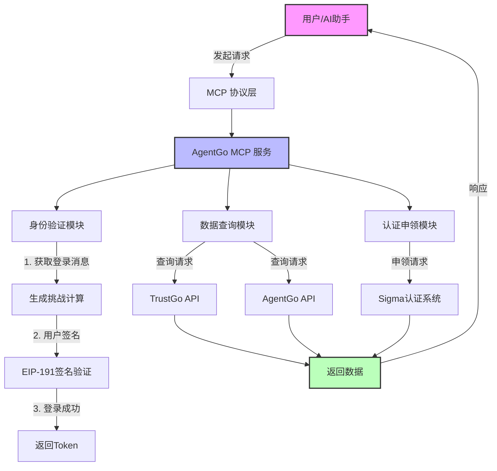

# AgentGo MCP 服务详细文档

## 目录
1. [什么是 MCP？](#什么是-mcp)
2. [MCP 的作用](#mcp-的作用)
3. [AgentGo MCP 服务概述](#agentgo-mcp-服务概述)
4. [服务架构流程图](#服务架构流程图)
5. [核心功能介绍](#核心功能介绍)
6. [使用示例](#使用示例)
7. [快速开始指南](#快速开始指南)

## 什么是 MCP？

MCP（Model Context Protocol）是一种标准化的协议，用于连接AI助手（如Claude）与外部工具和服务。它就像是AI世界的"USB接口"，让AI能够：

- 🔌 **连接外部服务**：让AI能够访问数据库、API、文件系统等
- 🛠️ **使用工具**：让AI能够执行特定任务，如查询数据、发送请求等
- 🔄 **交互通信**：实现AI与外部世界的双向数据交换

## MCP 的作用

对于非技术人员来说，MCP 的作用可以这样理解：

1. **扩展AI能力**：就像给手机安装APP一样，MCP让AI获得新技能
2. **实时数据访问**：AI可以获取最新的数据，而不仅仅依赖训练时的知识
3. **自动化操作**：AI可以帮您执行实际操作，而不只是提供建议
4. **安全可控**：所有操作都在受控环境中进行，保证数据安全

## AgentGo MCP 服务概述

AgentGo MCP 服务是一个专门为 AI Agent 设计的身份认证和数据查询服务。它提供了以下核心能力：

- 🔐 **身份认证**：使用区块链技术进行安全登录
- 📊 **数据查询**：获取Agent的各种评分和市场数据
- 🏆 **证明申领**：申请和管理Sigma认证
- 📈 **市场分析**：查看价格、份额等市场泡泡图

## 服务架构流程图



## 核心功能介绍

### 1. 身份认证系统

**功能说明**：使用区块链技术进行安全的身份验证

**工作流程**：
1. 获取登录消息和计算挑战
2. 完成数学计算验证（防机器人）
3. 使用私钥签名消息
4. 验证签名并颁发访问令牌

### 2. Sigma 评分查询

**功能说明**：查询AI Agent的信誉评分

**评分维度**：
- 技术能力评分
- 社区贡献度
- 活跃度指标
- 综合信誉分

### 3. 市场数据分析

**功能说明**：提供三种类型的市场泡泡图数据

**数据类型**：
- **价格泡泡图**：展示Agent的市场价值分布
- **Sigma评分泡泡图**：展示Agent的能力分布
- **市场份额泡泡图**：展示Agent的影响力分布

### 4. Sigma 认证申领

**功能说明**：为Agent申请官方认证标识

**认证类型**：
- 个人认证：为自己申请
- 代理认证：为其他Agent申请

## 使用示例

### 示例1：基础登录流程

```python
# 步骤1：获取登录消息
登录消息 = 获取登录消息(地址="0x1234...")
# 返回：
# {
#   "message": "sign the message to login trustgo1234567890",
#   "calculation_challenge": {
#     "formula": "1234567 * 2345678 + 123^2 - (1234567 % 123)"
#   }
# }

# 步骤2：计算挑战答案
答案 = 1234567 * 2345678 + 123^2 - (1234567 % 123)

# 步骤3：签名并登录
登录结果 = 登录(
    地址="0x1234...",
    签名="0xabcd...",
    消息=登录消息,
    计算结果=答案
)
```

### 示例2：查询Agent评分

```python
# 查询特定Agent的Sigma评分
评分数据 = 查询Sigma评分(agent标识="eliza")
# 返回：
# {
#   "agent": "eliza",
#   "sigma_scores": {
#     "technical": 85,
#     "community": 92,
#     "activity": 78,
#     "overall": 85
#   }
# }
```

### 示例3：查看市场数据

```python
# 查看价格泡泡图
价格数据 = 查询价格泡泡信息()
# 返回市场上所有Agent的价格分布数据

# 查看Sigma评分泡泡图
评分分布 = 查询Sigma评分泡泡信息()
# 返回所有Agent的能力分布数据

# 查看市场份额泡泡图
份额数据 = 查询市场份额泡泡信息(时间范围="24小时")
# 返回24小时内的市场份额变化
```

## 快速开始指南

### 对于非技术用户

1. **准备工作**
   - 拥有一个区块链钱包地址
   - 能够对消息进行签名（通过钱包软件）

2. **使用步骤**
   - 告诉AI助手您的钱包地址
   - AI会给您一个消息和计算题
   - 完成计算并用钱包签名消息
   - 将签名结果告诉AI
   - 现在您可以查询各种数据了！

3. **常用命令示例**
   - "帮我查询eliza这个Agent的评分"
   - "显示当前市场上的价格泡泡图"
   - "我想申请Sigma认证"
   - "查看最近24小时的市场份额变化"

### 对于技术用户

1. **环境配置**
   ```bash
   # 设置Agent地址环境变量
   export AGENT_ADDRESS="0x您的地址"
   
   # 安装依赖
   pip install -r requirements.txt
   
   # 运行服务
   python agentgo_mcp_service.py
   ```

2. **API调用示例**
   ```python
   # 使用MCP客户端连接服务
   client = MCPClient("agentgo-service")
   
   # 登录
   msg = await client.get_trustgo_login_message()
   result = await client.trustgo_login(
       address="0x...",
       signature="0x...",
       message=msg["message"],
       number=calculated_answer
   )
   ```

## 安全注意事项

1. **私钥安全**：永远不要分享您的私钥
2. **签名验证**：只签名您理解的消息
3. **Token保护**：妥善保管登录后的访问令牌
4. **计算验证**：正确完成计算挑战以防止自动化攻击

## 常见问题


**Q: 可以同时查询多个Agent吗？**
A: 可以，每个查询都是独立的，您可以连续查询多个Agent。

**Q: 数据多久更新一次？**
A: 市场数据通常每几分钟更新一次，具体取决于数据源。