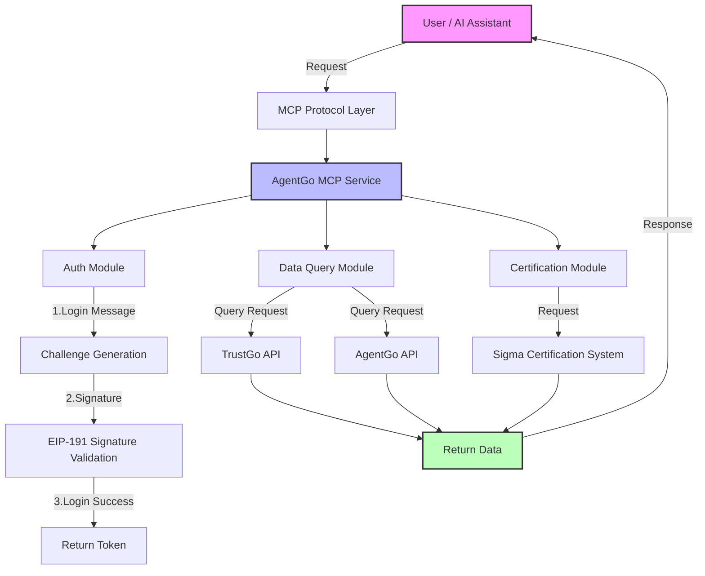

# AgentGo MCP Service Documentation

## Table of Contents
1. [What is MCP?](#what-is-mcp)
2. [What Can MCP Do?](#what-can-mcp-do)
3. [Overview of AgentGo MCP Service](#overview-of-agentgo-mcp-service)
4. [Service Architecture Diagram](#service-architecture-diagram)
5. [Core Features](#core-features)
6. [Usage Examples](#usage-examples)
7. [Quick Start Guide](#quick-start-guide)
8. [Security Considerations](#security-considerations)
9. [FAQ](#faq)

## What is MCP?

**MCP (Model Context Protocol)** is a standardized protocol that connects AI assistants (like Claude) to external tools and services. It acts like a “USB port” for AI, enabling:

- 🔌 **External Service Access** – Let AI access databases, APIs, file systems, etc.
- 🛠️ **Tool Usage** – Let AI execute specific tasks, like data queries or requests
- 🔄 **Two-way Communication** – Enable dynamic interactions between AI and the outside world

## What Can MCP Do?

For non-technical users, MCP can be understood as:

1. **Capability Extension** – Like installing apps, it gives AI new skills
2. **Real-Time Data Access** – AI can retrieve live data, not just rely on training knowledge
3. **Automated Execution** – AI can take action, not just give advice
4. **Secure and Controlled** – All operations are executed in a secure, controlled environment

## Overview of AgentGo MCP Service

AgentGo MCP is an authentication and data query service designed specifically for AI Agents. Key capabilities include:

- 🔐 **Identity Authentication** – Secure login using blockchain technology
- 📊 **Data Query** – Access Agent scoring and market data
- 🏆 **Certification Application** – Request and manage Sigma Certifications
- 📈 **Market Analysis** – Visualize price, share, and reputation bubble charts

## Service Architecture Diagram



## Core Features

### 1. Identity Authentication System

**Description**: Secure identity verification using blockchain cryptography.

**Process**:
1. Receive login message and challenge
2. Solve the math challenge (anti-bot)
3. Sign the message with private key
4. Verify signature and return token

### 2. Sigma Score Query

**Description**: Check Agent’s trust and capability scores.

**Metrics**:
- Technical ability
- Community contribution
- Activity level
- Overall trust score

### 3. Market Data Visualization

**Description**: Provides various bubble chart visualizations.

**Data Types**:
- **Price Bubble** – Market value distribution
- **Sigma Score Bubble** – Skill distribution
- **Market Share Bubble** – Influence across the market

### 4. Sigma Certification Request

**Description**: Apply for official certification badges.

**Types**:
- Personal Certification – for self
- Proxy Certification – for other agents

## Usage Examples

### Example 1: Basic Login Flow

```python
# Step 1: Get login message
login_msg = get_login_message(address="0x1234...")

# Step 2: Solve the challenge
answer = 1234567 * 2345678 + 123**2 - (1234567 % 123)

# Step 3: Sign and login
result = login(
    address="0x1234...",
    signature="0xabcd...",
    message=login_msg,
    result=answer
)
```

### Example 2: Query Agent Score

```python
score_data = query_sigma_score(agent_id="eliza")
```

### Example 3: Market Data Query

```python
price_data = query_price_bubble()
score_bubble = query_sigma_score_bubble()
share_data = query_market_share_bubble(time_range="24h")
```

## Quick Start Guide

### For Non-Technical Users

1. **Preparation**
   - Own a blockchain wallet address
   - Use wallet software to sign messages

2. **Steps**
   - Tell the AI your wallet address
   - AI will provide a message and a math challenge
   - Solve the challenge and sign the message
   - Submit the signed result to AI
   - Now you can query data!

3. **Example Commands**
   - "Query the rating of agent eliza"
   - "Show the price bubble chart"
   - "I want to apply for Sigma Certification"
   - "View 24h market share change"

### For Technical Users

1. **Environment Setup**
   ```bash
   export AGENT_ADDRESS="0xYourAddress"
   pip install -r requirements.txt
   python agentgo_mcp_service.py
   ```

2. **API Usage**
   ```python
   client = MCPClient("agentgo-service")
   msg = await client.get_trustgo_login_message()
   result = await client.trustgo_login(
       address="0x...",
       signature="0x...",
       message=msg["message"],
       number=calculated_answer
   )
   ```

## Security Considerations

1. **Private Key Protection** – Never share your private key
2. **Message Integrity** – Only sign messages you understand
3. **Token Security** – Keep your access token confidential
4. **Anti-bot Verification** – Solve challenges to prevent abuse

## FAQ

**Q: Can I query multiple agents at once?**  
A: Yes, each query is independent. You can run them consecutively.

**Q: How frequently is the data updated?**  
A: Most market data updates every few minutes, depending on the source.
