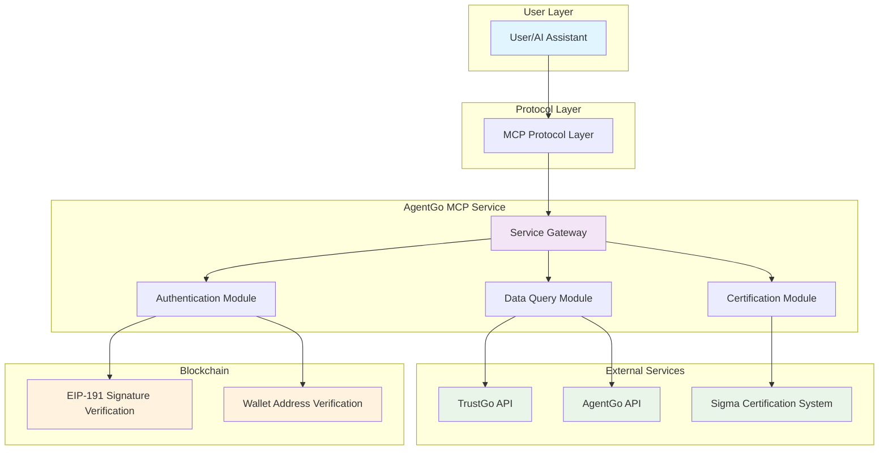

# AgentGo MCP Service Documentation

## 📖 Table of Contents

1. [Overview](#overview)
2. [Architecture](#architecture)
3. [Integration with Cursor](#integration-with-cursor)
4. [Available Prompts and Tools](#available-prompts-and-tools)
5. [License](#license)

---

## Overview

**AgentGo MCP Service** is an authentication and data query service designed specifically for AI agents, providing blockchain identity authentication, agent scoring queries, market data analysis, and other core capabilities for AI assistants through the MCP protocol.

### ✨ Main Features

- 🔐 **Secure Authentication** - Blockchain-based identity verification system
- 📊 **Data Queries** - Real-time agent scoring and market data retrieval
- 🏆 **Certification Applications** - Sigma certification badge application and management
- 📈 **Visualization Analysis** - Multi-dimensional market data bubble chart display

### 🎥 Demo Video

[](https://www.youtube.com/watch?v=9j6Ghq6FOvA)

---

## Architecture



### 🏗️ Architecture Description

1. **User Layer**: AI assistants or user interfaces
2. **Protocol Layer**: MCP standard protocol processing
3. **Service Layer**: AgentGo core business logic
4. **External Services**: Third-party APIs and data sources
5. **Blockchain Layer**: Identity verification and signature validation

---

## Integration with Cursor

Default mode

```json
{
   "mcpServers": {
      "AgentGoMcp": {
      "command": "python3",
      "args": ["gentgo_mcp_service.py"],
      "env": {
         "AGENT_ADDRESS": "0x39a39981bF87EE0e8E9D6434A56f00758c9666f0"
      }
      }
   }
}
```

---

## Available Prompts and Tools

### Prompts

| Name | Description | Usage Example |
|------|-------------|---------------|
| `analyze_agent` | Analyze agent performance and capabilities | **User**: "Analyze agent eliza's performance" **Agent**: Provides detailed analysis of technical ability, community contribution, and activity metrics |
| `compare_agents` | Compare multiple agents side by side | **User**: "Compare eliza, agent-zero, and virtuals" **Agent**: Shows comparative scores and highlights strengths of each agent |
| `market_overview` | Get overall market analysis and trends | **User**: "Show me the current market overview" **Agent**: Displays market trends, top performers, and key metrics |
| `certification_guide` | Get guidance on certification process | **User**: "How do I apply for Sigma certification?" **Agent**: Explains certification types, requirements, and application process |

### Tools

| Name | Description | Usage Example |
|------|-------------|---------------|
| `trustgo_login` | Execute login verification with blockchain wallet | **User**: "I want to authenticate with wallet 0x742d35..." **Agent**: Provides login message and math challenge for signature verification |
| `query_sigma_score` | Query agent Sigma score and capability metrics | **User**: "What's the Sigma score for agent eliza?" **Agent**: Returns score breakdown with technical ability, community contribution, and activity level |
| `query_price_bubble` | Get price bubble chart data for market visualization | **User**: "Show me the current price bubble chart" **Agent**: Generates bubble chart with top performers by market value |
| `query_sigma_score_bubble` | Get score bubble chart data for agent analysis | **User**: "Display score bubble chart" **Agent**: Shows agent skill distribution visualization |
| `query_market_share_bubble` | Get market share bubble chart data with time options | **User**: "Market share changes in last 24h" **Agent**: Shows biggest gainers and losers with percentage changes |
| `apply_sigma_certification` | Apply for Sigma certification (personal or proxy) | **User**: "I want to apply for Sigma certification" **Agent**: Submits application with expected 1-3 day processing time |

---

## License

This project is licensed under the MIT License - see the [LICENSE](LICENSE) file for details.