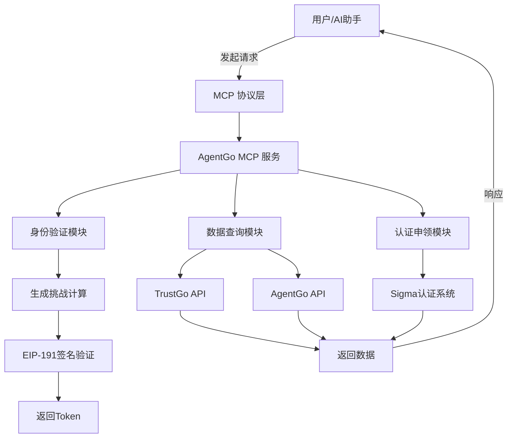

# AgentGo MCP Service Documentation

## Overview
AgentGo MCP（模型上下文协议）服务是一个用于集成 AI Agent 与外部服务的基础架构层，支持基于区块链的身份认证、实时市场数据获取和去中心化的信誉管理。

---
## 英文文档

[English Documentation](https://github.com/Quan3Xin/AgentGoMcp_Demo/blob/main/AgentGo_MCP_EN.md)
---

## 功能亮点

- 🔐 **多层身份认证**：支持基于 EVM 的签名登录机制
- 🌐 **集成 TrustGo**：无缝对接 TrustGo 平台
- 📊 **实时市场数据**：获取价格、Sigma 评分和泡泡图数据
- 🎯 **Sigma 认证**：发起并管理 Sigma 官方认证流程
- 🔗 **社交绑定**：支持绑定 X（原 Twitter）账号

---

## 快速开始

### 面向开发者

1. **安装依赖**
   ```bash
   pip install -r requirements.txt
   ```

2. **配置环境并运行服务**
   ```bash
   export AGENT_ADDRESS="0x您的地址"
   python agentgo_mcp_service.py
   ```

3. **API 调用示例**
   ```python
   client = MCPClient("agentgo-service")
   msg = await client.get_trustgo_login_message()
   result = await client.trustgo_login(
       address="0x...",
       signature="0x...",
       message=msg["message"],
       number=calculated_answer
   )
   ```

### 面向非技术用户

1. 准备好区块链钱包地址
2. AI 助手会发送登录消息和计算题
3. 使用钱包签名消息，提交签名结果
4. 登录成功后，即可开始使用各项功能

---

## 什么是 MCP？

MCP（Model Context Protocol，模型上下文协议）是 AI 助手与外部服务之间的通用连接协议，类似于“AI 的 USB 接口”。

### 核心作用

1. **扩展能力**：让 AI 获得新的技能模块
2. **实时获取数据**：接入最新市场和外部数据
3. **自动执行操作**：不仅提供建议，还能实际执行
4. **安全可控交互**：确保数据交换可追踪、可验证

---

## 服务架构流程图



---

## 核心功能

### 1. 身份验证
- 基于 EIP-191 标准的签名机制
- 计算挑战以防止自动化攻击

### 2. Sigma 评分查询
- 技术能力评分
- 社区贡献分
- 活跃度指数
- 综合信誉评分

### 3. 市场数据泡泡图
- **价格泡泡图**
- **Sigma 能力泡泡图**
- **市场份额泡泡图**

### 4. Sigma 认证申领
- **个人认证**：为自身申请 Sigma 认证
- **代理认证**：帮助其他 Agent 发起认证请求

---

## 使用示例

### 示例一：登录流程
```python
msg = 获取登录消息(地址="0x1234...")
答案 = 1234567 * 2345678 + 123^2 - (1234567 % 123)
登录结果 = 登录(
    地址="0x1234...",
    签名="0xabcd...",
    消息=msg,
    计算结果=答案
)
```

### 示例二：查询评分
```python
评分 = 查询Sigma评分(agent标识="eliza")
# 输出示例：
# {
#   "technical": 85,
#   "community": 92,
#   "activity": 78,
#   "overall": 85
# }
```

### 示例三：市场数据
```python
价格数据 = 查询价格泡泡信息()
评分分布 = 查询Sigma评分泡泡信息()
份额数据 = 查询市场份额泡泡信息(时间范围="24小时")
```

---

## 安全提示

- 请勿泄露私钥
- 仅对您理解的消息进行签名
- 登录后的 Token 请妥善保管
- 按要求完成计算验证，防止自动脚本攻击

---

## 常见问题（FAQ）

**Q: 能否一次查询多个 Agent？**  
A: 可以，每个请求是独立处理的。

**Q: 数据多久更新一次？**  
A: 每几分钟更新一次，依赖具体数据源。

---

## License

本服务隶属于 AgentGo 生态系统，专为 Agent 认证、评分与实时数据集成而设计。

---

## 视频演示

[](https://www.youtube.com/watch?v=rKFAPkludaw)
