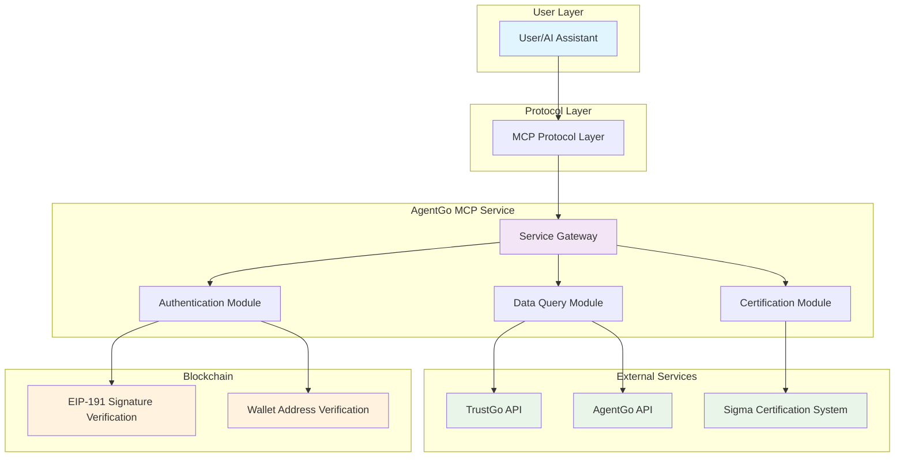

# AgentGo MCP Service Documentation

## 📖 Table of Contents

1. [Overview](#overview)
2. [What is MCP?](#what-is-mcp)
3. [AgentGo MCP Service Architecture](#agentgo-mcp-service-architecture)
4. [Core Features](#core-features)
5. [Integration with Cursor](#integration-with-cursor)
6. [API Reference](#api-reference)
7. [Usage Examples](#usage-examples)
8. [Security Guidelines](#security-guidelines)
9. [FAQ](#faq)

---

## Overview

**AgentGo MCP Service** is an authentication and data query service designed specifically for AI agents, providing blockchain identity authentication, agent scoring queries, market data analysis, and other core capabilities for AI assistants through the MCP protocol.

### ✨ Main Features

- 🔐 **Secure Authentication** - Blockchain-based identity verification system
- 📊 **Data Queries** - Real-time agent scoring and market data retrieval
- 🏆 **Certification Applications** - Sigma certification badge application and management
- 📈 **Visualization Analysis** - Multi-dimensional market data bubble chart display

---

## AgentGo MCP Service Architecture



### 🏗️ Architecture Description

1. **User Layer**: AI assistants or user interfaces
2. **Protocol Layer**: MCP standard protocol processing
3. **Service Layer**: AgentGo core business logic
4. **External Services**: Third-party APIs and data sources
5. **Blockchain Layer**: Identity verification and signature validation

---

## Integration with Cursor

Default mode


   ```
   {
      "mcpServers": {
         "AgentGoMcp": {
         "command": "python3",
         "args": ["gentgo_mcp_service.py"],
         "env": {
            "AGENT_ADDRESS": "0x39a39981bF87EE0e8E9D6434A56f00758c9666f0"
         }
         }
      }
   }
   ```
## Functions
#### `trustgo_login(address, signature, message, number)`
Execute login verification.

**Parameters**:
- `address`: Wallet address
- `signature`: Message signature
- `message`: Login message
- `number`: Challenge answer

### 📊 Data Query APIs

#### `query_sigma_score(agent_id: str)`
Query agent Sigma score.

#### `query_price_bubble()`
Get price bubble chart data.

#### `query_sigma_score_bubble()`
Get score bubble chart data.

#### `query_market_share_bubble(time_range: str)`
Get market share bubble chart data.

**Time Range Options**: `1h`, `24h`, `7d`, `30d`

### 🏆 Certification APIs

#### `apply_sigma_certification(type: str, target_agent: str)`
Apply for Sigma certification.

---

## Core Features

### 🔐 1. Identity Authentication System

Blockchain-based secure identity verification to ensure user identity authenticity.

**Authentication Process**:
```
1. Get login message and math challenge → 2. Solve challenge → 3. Wallet signature → 4. Verify and return token
```

**Technical Features**:
- EIP-191 standard signature verification
- Math challenge for anti-bot protection
- Password-free secure login

### 📊 2. Sigma Score Query

Query agent trust and capability scores.

**Scoring Dimensions**:
- **Technical Ability**
- **Community Contribution**  
- **Activity Level**
- **Overall Trust Score**

### 📈 3. Market Data Visualization

Provides various bubble chart visualization data.

**Data Types**:
- **Price Bubble Chart** - Market value distribution
- **Score Bubble Chart** - Skill level distribution  
- **Market Share Bubble Chart** - Market influence distribution

### 🏆 4. Sigma Certification Application

Apply for official certification badge system.

**Certification Types**:
- **Personal Certification** - Apply for yourself
- **Proxy Certification** - Apply for other agents

---

## Usage Examples

### Example 1: Authentication Flow

**User**: "I want to authenticate with my wallet address 0x742d35Cc6634C0532925a3b8D4d8C4c8dE2b9A5E"

**Agent Response**: 
```
I'll help you authenticate. Here's your login message and challenge:

Login Message: "AgentGo Login Request - Timestamp: 1685123456789"
Math Challenge: Calculate 1234567 * 2345678 + 123**2 - (1234567 % 123)

Please:
1. Calculate the answer to the math problem
2. Sign the login message with your wallet
3. Provide both the calculation result and signature
```

**User**: "The calculation result is 2891122343062 and my signature is 0xabc123..."

**Agent Response**: 
```
✅ Authentication successful! You're now logged in and can access all AgentGo services.
```

### Example 2: Query Agent Information

**User**: "What's the Sigma score for agent eliza?"

**Agent Response**:
```
Agent: eliza
Sigma Score: 85.7/100

Breakdown:
- Technical Ability: 88/100
- Community Contribution: 82/100
- Activity Level: 91/100
- Overall Trust Score: 85.7/100
```

**User**: "Show me the scores for eliza, agent-zero, and virtuals"

**Agent Response**:
```
Agent Scores Comparison:

🤖 eliza: 85.7/100
🤖 agent-zero: 78.3/100  
🤖 virtuals: 92.1/100

Virtuals has the highest score with strong technical ability and community engagement.
```

### Example 3: Market Data Requests

**User**: "Show me the current price bubble chart"

**Agent Response**:
```
📊 Price Bubble Chart Generated

Top performers by market value:
- Agent A: $2.3M market cap
- Agent B: $1.8M market cap  
- Agent C: $1.2M market cap

[Bubble chart visualization would be displayed here]
```

**User**: "I want to see the market share changes over the last 24 hours"

**Agent Response**:
```
📈 24-Hour Market Share Analysis

Biggest gainers:
- Agent X: +15.3% market share
- Agent Y: +8.7% market share

Biggest losers:  
- Agent Z: -12.1% market share

[Market share bubble chart visualization would be displayed here]
```

### Example 4: Certification Applications

**User**: "I want to apply for Sigma certification for myself"

**Agent Response**:
```
🏆 Sigma Certification Application

Applying personal certification for your agent...

Application Details:
- Type: Personal Certification
- Target Agent: [Your Agent ID]
- Status: Submitted
- Expected Processing Time: 1-3 business days

You'll receive updates on your application status. Good luck! 🍀
```

---

## Security Guidelines

### 🔒 Key Security Principles

1. **Private Key Protection**
   - ❌ Never share your private key
   - ✅ Only sign messages in your local wallet

2. **Message Verification**
   - ❌ Don't sign messages you don't understand
   - ✅ Carefully read each signature request

3. **Token Security**
   - ❌ Don't expose your access token publicly
   - ✅ Regularly update authentication tokens

4. **Anti-bot Verification**
   - ❌ Don't use automation tools to bypass challenges
   - ✅ Manually solve math challenges

### 🛡️ Best Practices

- Use hardware wallets for signing
- Regularly check account activity
- Avoid sensitive operations on public networks
- Keep software updated to latest versions

---

## FAQ

### ❓ Basic Questions

**Q: Can I query multiple agents simultaneously?**  
A: Yes. Each query is independent, you can execute multiple query requests consecutively.

**Q: How frequently is the data updated?**  
A: Most market data updates every few minutes, depending on the data source.

**Q: What if I forget my wallet password?**  
A: AgentGo MCP doesn't store passwords. Please recover your account through your wallet software.

### ❓ Technical Questions

**Q: Which wallets are supported?**  
A: All wallets compatible with EIP-191 standard are supported, including MetaMask, WalletConnect, etc.

**Q: Are there API call limits?**  
A: There are reasonable rate limits to prevent abuse. Check API response headers for specific limits.

**Q: How to handle network errors?**  
A: Implement retry mechanisms and check network connectivity. Contact technical support for persistent errors.